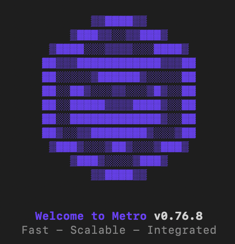

[Delivery icons created by dreamicons - Flaticon](https://www.flaticon.com/free-icons/delivery)

# 첫 시작(setting)
[공식문서](https://reactnative.dev/)
- 초기 세팅(Expo말고 React Native CLI Quickstart): [반드시 따라하기](https://reactnative.dev/docs/environment-setup) 
- java 17 버전 설치하면 안 됨(11버전 설치할 것), JAVA_HOME 환경 변수 설정도 잘 해 놓을 것([macOS JAVA_HOME 세팅법](https://stackoverflow.com/a/59151321))
- Android 13(티라미수)이 있어야 함. 가상기기는 Nexus 5로 받을 것
- 터미널에 adb 입력해서 안 뜨면 [adb](https://developer.android.com/studio/releases/platform-tools) 설치 필요, ANDROID_HOME 환경변수도
- [읽어보면 좋은 벨로퍼트님의 글](https://ridicorp.com/story/react-native-1year-review/)

```shell
# 프로젝트를 만들고자 하는 폴더로 이동
npx react-native init FoodDeliveryApp

# 다음 말이 뜨면 y 입력
Need to install the following packages:
  react-native@0.72.7
Ok to proceed? (y)

# Do you want to install CocoaPods now? 뜨면 y 입력
# 실수로 y 안 눌러서 CocoaPods 수동설치하려면
sudo gem install cocoapods
# cocoapods 설치시 ruby 오류가 나면 터미널에 나오는 명령어 입력 후 cocoapods 재설치(아래 버전은 달라질 수 있으니 주의)
sudo gem install activesupport -v 6.1.7.6

# 마지막으로 pod 설치
cd ./FoodDeliveryApp/ios && pod install
```

**잠깐!!** 이 명령어를 입력하면 항상 최신 버전의 react를 받아오므로 강좌의 버전(0.66)과 일치하지 않게 됨. 현재 최신 버전은 0.72이라서 상당히 차이가 남.
강좌랑 동일한 버전으로 하지 않으면 많은 스트레스를 받을 수 있음.
- 강좌랑 동일한 버전으로 하려면 이미 초반 세팅이 다 되어 있는 setting 폴더를 git clone받아 시작하는 것이 좋음(클론 후 npm i && npx pod-install 수행 필요).
- 0.72버전으로 시작하려면 setting72 폴더에서 시작하면 됨.
- 0.72, 0.73 버전 최종 소스코드도 깃헙에 존재하니 각각의 폴더 참고. 0.72버전으로 해도 잘 돌아가긴 함. 0.73은 아직 불안정

보통은 강의용으로 자동생성 안 좋아하는데 RN은 자동생성하지 않으면 네이티브단까지 처리하기 어려움 

프로젝트 폴더에서 다음 명령어로 앱 실행 가능
```shell
npm start # rn 73 버전에서는 npm start 후 뜨는 화면에서 i나 a를 눌러 아이폰/안드로이드 실행

# rn72까지는
npm run android # 안드로이드 실행 명령어
npm run ios # 아이폰 실행 명령어
```


서버가 하나 뜰 것임. Metro 서버. 여기서 서버가 안 뜨고 No device 등의 에러 메시지가 뜬다면 안드로이드 에뮬레이터 실행한 채로 다시 명령어 입력할 것.
Metro 서버에서 소스 코드를 컴파일하고 앱으로 전송해줌. 기본 8081포트.

메트로 서버가 꺼져있다면 터미널을 하나 더 열어
```shell
npm start
```

개발은 iOS 기준으로 하는 게 좋다(개인 경험). 그러나 강좌는 어쩔 수 없이 Windows로 한다.

react-native@0.72 버전, 한 달에 0.1씩 올라가는데 요즘 개발 속도가 느려져서 규칙이 깨짐. 거의 완성 단계라 신규 기능은 npm에서 @react-native-community로부터 받아야 함. 버전 업그레이드 함부로 하지 말 것!

[맥 전용]npx pod-install도 미리 한 번, iOS 라이브러리(pod) 받는 용도

## 폴더 구조
- android: 안드로이드 네이티브 폴더
- ios: ios 네이티브 폴더
- node_modules: 노드 라이브러리
- app.json: name은 앱 컴포넌트 이름이니 함부로 바꾸면 안 됨, 이거 바꾸면 네이티브 컴포넌트 이름도 다 바꿔야함, displayName은 앱 이름 변경용
  - ios/FoodDeliveryApp/AppDelegate.mm 의 moduleName
  - android/app/src/main/java/com/fooddeliveryapp/MainActivity.java 의 getMainComponentName
- babel.config.js: 바벨 설정
- index.js: 메인 파일
- App.tsx: 기본 App 컴포넌트
- metro.config.js: 메트로 설정 파일(웹팩 대신 사용)
- tsconfig.json: 타입스크립트 설정
- android/app/src/main/java/com/fooddeliveryapp/MainActivity.java: 안드로이드 액티비티에서 js엔진 통해 리액트 코드 실행 + bridge로 소통

## 앱 실행 후
- cmd + R로 리로딩
- cmd + D로 디버그 메뉴
- Debugging with Chrome으로 개발자 도구 사용 가능
- Configure Bundler로 메트로 서버 포트 변경 가능
- Show Perf Monitor로 프레임 측정 가능

[Flipper](https://fbflipper.com/) 페이스북이 만든 모바일앱 디버거도 좋음(다만 연결 시 에러나는 사람 다수 발견)
- [ios]설치 시 환경설정 -> 개인정보 및 보안 메뉴에서 Flipper를 허용해주어야 함
- troubleshoot -> setup doctor 문제 해결할 것
```shell
npm i react-native-flipper redux-flipper rn-flipper-async-storage-advanced @react-native-async-storage/async-storage
npx pod-install # 아이폰 전용
```
- flipper-plugin-async-storage-advanced
- flipper-plugin-redux-debugger
- Layout, Network, Images, Database(sqlite), React Devtools, Hermes Debugger 사용 가능

## 앱 이름 변경
\android\app\src\main\res\values\strings.xml

app.json의 displayName

\ios\FoodDeliveryApp\Info.plist의 CFBundleDisplayName

**단!** 0.68버전부터는 app.json, strings.xml, CFBundleDisplayName을 한글로하면 튕기는 문제 발생. 그럴때는 전부 영어로 되돌리고
ios에서는 [링크](https://thddudco.tistory.com/16) 따라서 다국어 설정으로 한국어 설정할 것.
또한 안드로이드에서는 \android\app\src\main\res\values\strings.xml은 영어로 두고 \android\app\src\main\res\values-ko\strings.xml 을 새로 만들어 여기서 한글로 변경할 것

android/gradle.properties
```
FLIPPER_VERSION=0.145.0
```
플리퍼 버전이 0.145.0보다 낮다면 0.145.0으로 높일 것. RN 0.72버전에서는 이미 0.182.0임

## 리액트 네이티브 폴더 구조
- src 폴더 생성(지금 바로 생성 안 하고 폴더 안에 파일이 들 때 생성해도 됨)
- src/assets: 이미지, 폰트 등
- src/constants: 상수
- src/pages: 페이지 단위 컴포넌트
- src/components: 기타 컴포넌트
- src/contexts: context api 모음
- src/hooks: 커스텀 훅 모음
- src/modules: 네이티브 모듈
- src/store: 리덕스 스토어 세팅
- src/slices: 리덕스 슬라이스
- types: 타입 정의

# 코딩 시작!
## App.tsx 분석
- View가 div, Text가 span이라고 생각하기(1대1 매칭은 아님)
- css는 dp 단위(density-independent pixels, 다양한 화면 크기에 영향받지 않음)
- [css 속성 리스트](https://github.com/vhpoet/react-native-styling-cheat-sheet): 좀 오래됨
- flex에서는 flexDirection이 Column이 default

## React Navigation
react-router-native도 대안임(웹에서 넘어온 개발자들에게 친숙, 웹처럼 주소 기반)
```shell
npm i @react-navigation/native
npm i @react-navigation/native-stack
npm i react-native-screens@3.22.1 react-native-safe-area-context
npx pod-install # 맥 전용
```
android/app/src/main/java/FoodDeliveryApp/MainActivity.java
```java
import android.os.Bundle;
...
@Override
protected void onCreate(Bundle savedInstanceState) {
  super.onCreate(null);
}
```
android/build.gradle
```
buildscript {
    ext {
        ...
        kotlin_version = '1.6.10'
    }
    ...
    dependencies {
        ...
        classpath "org.jetbrains.kotlin:kotlin-gradle-plugin:$kotlin_version"
    }
    ...
}
```
App.tsx 교체
```typescript jsx
import * as React from 'react';
import {NavigationContainer, ParamListBase} from '@react-navigation/native';
import {
  createNativeStackNavigator,
  NativeStackScreenProps,
} from '@react-navigation/native-stack';
import {Text, TouchableHighlight, View} from 'react-native';
import {useCallback} from 'react';

type RootStackParamList = {
  Home: undefined;
  Details: undefined;
};
type HomeScreenProps = NativeStackScreenProps<RootStackParamList, 'Home'>;
type DetailsScreenProps = NativeStackScreenProps<ParamListBase, 'Details'>;

function HomeScreen({navigation}: HomeScreenProps) {
  const onClick = useCallback(() => {
    navigation.navigate('Details');
  }, [navigation]);

  return (
          <View style={{flex: 1, alignItems: 'center', justifyContent: 'center'}}>
            <TouchableHighlight onPress={onClick}>
              <Text>Home Screen</Text>
            </TouchableHighlight>
          </View>
  );
}

function DetailsScreen({navigation}: DetailsScreenProps) {
  const onClick = useCallback(() => {
    navigation.navigate('Home');
  }, [navigation]);

  return (
          <View style={{flex: 1, alignItems: 'center', justifyContent: 'center'}}>
            <TouchableHighlight onPress={onClick}>
              <Text>Details Screen</Text>
            </TouchableHighlight>
          </View>
  );
}

const Stack = createNativeStackNavigator<RootStackParamList>();
function App() {
  return (
          <NavigationContainer>
            <Stack.Navigator initialRouteName="Home">
              <Stack.Screen
                      name="Home"
                      component={HomeScreen}
                      options={{title: 'Overview'}}
              />
              <Stack.Screen name="Details">
                {props => <DetailsScreen {...props} />}
              </Stack.Screen>
            </Stack.Navigator>
          </NavigationContainer>
  );
}

export default App;
```
- safe-area가 적용되어 있음(설명)
- NavigationContainer: 내비게이션 상태 저장
- Navigator 안에 Screen들 배치
- Screen name 대소문자 상관 없음, component는 보통 두 가지 방식 사용(컴포넌트 그 자체 vs Render Callback)
- props로 navigation과 route가 전달됨
- Pressable, Button, TouchableHighlight, TouchableOpacity, TouchableWithoutFeedback, TouchableNativeFeedback
- navigation.navigate로 이동 가능
- navigation.push로 쌓기 가능
- navigation.goBack으로 이전으로 이동
- params 추가 가능(params에 user같은 객체를 통째로 넣지 말기, id를 넣고 user는 글로벌 스토어에 넣기)
- Screen options.title: 제목
- Screen options에 함수를 넣어 route.params로 params 접근 가능
- navigation.setOptions로 옵션 변경 가능
- Navigator screenOptions로 공통 옵션 설정
- Screen options.headerShown로 헤더표시여부
- Screen options.headerTitle로 커스텀 컴포넌트
- Screen options.headerRight로 우측 버튼(useLayoutEffect)
[옵션 목록](https://reactnavigation.org/docs/screen-options)

## 실제 라우터 만들기 (ch1)
```shell
npm install @react-navigation/bottom-tabs
```

App.tsx
```typescript jsx

```
- Tab.Navigator 도입
- isLoggedIn 분기처리
- Drawer과 Tab.Group 사용처 소개
src/pages/Delivery.tsx
```typescript jsx

```
- Navigator는 nesting 가능
## 회원가입, 로그인 화면 만들기
src/components/DismissKeyBoardView.tsx
```typescript jsx
import React from 'react';
import {
  TouchableWithoutFeedback,
  Keyboard,
  StyleProp,
  ViewStyle,
  KeyboardAvoidingView,
  Platform,
} from 'react-native';

const DismissKeyboardView: React.FC<{ style: StyleProp<ViewStyle> }> = ({children, ...props}) => (
  <TouchableWithoutFeedback onPress={Keyboard.dismiss} accessible={false}>
    <KeyboardAvoidingView
      {...props}
      style={props.style}
      behavior={Platform.OS === 'android' ? undefined : 'padding'}>
      {children}
    </KeyboardAvoidingView>
  </TouchableWithoutFeedback>
);

export default DismissKeyboardView;
```
인풋 바깥 클릭 시 키보드를 가리기 위함
- src/pages/SignIn.tsx
- src/pages/SignUp.tsx
- src/components/DismissKeyboardView.tsx
- TextInput, StyleSheet.compose 사용
- DismissKeyboardView 만들기(Keyboard, KeyboardAvoidingView)
- KeyboardAvoidingView는 불편함
- react-native-keyboard-aware-scrollview를 대안으로 사용
``` shell
npm i react-native-keyboard-aware-scrollview  
```
- 타이핑이 없으므로 직접 타입 추가해야 함
- react-native-keyboard-aware-scroll-view 라이브러리는 타입이 있음

types/react-native-keyboard-aware-scroll-view
```
```
src/components/DismissKeyBoardView.tsx
```typescript jsx

```
## 서버 요청 보내기(ch2)

back 서버 실행 필요, DB 없이도 되게끔 만들어둠. 서버 재시작 시 데이터는 날아가니 주의
```shell
# 터미널 하나 더 켜서
cd back
npm start
```

리덕스 설정
```shell
npm i @reduxjs/toolkit react-redux redux-flipper
```
src/store/index.ts와 src/store/reducer.ts, src/slices/user.ts 작성

AppInner.tsx 생성 및 isLoggedIn을 redux로 교체(AppInner 분리 이유는 App.tsx에서 useSelector를 못 씀)

App.tsx
```typescript jsx
import * as React from 'react';
import {NavigationContainer} from '@react-navigation/native';
import {Provider} from 'react-redux';
import store from './src/store';
import AppInner from './AppInner';

function App() {
  return (
    <Provider store={store}>
      <NavigationContainer>
        <AppInner />
      </NavigationContainer>
    </Provider>
  );
}

export default App;
```
## 회원가입, 로그인
액세스토큰/리프레시토큰을 받아서 다음 라이브러리로 저장
```shell
npm install react-native-encrypted-storage
npx pod-install # ios 전용
```
서버 요청은 axios 사용(요즘 ky나 got으로 넘어가는 추세이나 react-native와 호환 여부 불투명)
```shell
npm i axios
```
환경변수, 키 값을 저장할 config 패키지 
```shell
npm i react-native-config
```
```typescript jsx
import Config from 'react-native-config';
```
-Android에서 Config가 적용이 안 되면 다음 추가해야함

android/app/proguard-rules.pro
```
-keep class com.fooddeliveryapp.BuildConfig { *; }
```
android/app/build.gradle
```
apply plugin: "com.android.application"
apply from: project(':react-native-config').projectDir.getPath() + "/dotenv.gradle"
...
    defaultConfig {
        ...
        resValue "string", "build_config_package", "com.fooddeliveryapp"
    }
```
- .env에 키=값 저장해서(예를 들어 abc=def) Config.abc로 꺼내 씀
.env
```
API_URL=http://10.0.2.2:3105
```
- 안드로이드 아이피는 10.0.2.2로 해야 함(localhost로 하면 안드로이드에서 안 됨)
- 10.0.2.2가 안 되면 네이버에 내 아이피 쳐서 외부IP도 입력해보고, ipconfig 터미널에 입력할 때 나오는 내부IP도 입력해서 되는 것 찾기
- 에뮬레이터/시뮬레이터/실제 기기에서 브라우저를 켜서 아이피:3105 입력했을 때 페이지가 제대로 뜨는 IP가 실제로 작동하는 IP
- [ios]에서는 127.0.0.1 IP로 쓰기
- [ios]에서 안 될 때는 Podfile에 pod 'react-native-config', :path => '../node_modules/react-native-config/react-native-config.podspec' 추가해보기


암호화해서 저장할 데이터는 다음 패키지에
```
import EncryptedStorage from 'react-native-encrypted-storage';
```
```typescript jsx
await EncryptedStorage.setItem('키', '값');
await EncryptedStorage.removeItem('키');
const 값 = await EncryptedStorage.getItem('키');
```
- redux에 넣은 데이터는 앱을 끄면 날아감
- 앱을 꺼도 저장되어야 하고 민감한 값은 encrypted-storage에
- 개발 환경별로 달라지는 값은 react-native-config에 저장하면 좋음(암호화 안 됨)
- 그 외에 유지만 되면 데이터들은 async-storage에 저장(npm install @react-native-async-storage/async-storage)

src/pages/SignUp.tsx, src/pages/SignIn.tsx
```
```
android에서 http 요청이 안 보내지면
- android/app/src/main/AndroidManifest.xml 에서 <application> 태그에 android:usesCleartextTraffic="true" 추가

ActivityIndicator로 로딩창 꾸미기

## 소켓IO 연결
웹소켓 기반 라이브러리
- 요청-응답 방식이 아니라 실시간 양방향 통신 가능
```shell
npm i socket.io-client
```
src/hooks/useSocket.ts
```typescript jsx
import {useCallback} from 'react';
import {io, Socket} from 'socket.io-client';
import Config from 'react-native-config';

let socket: Socket | undefined;
const useSocket = (): [Socket | undefined, () => void] => {
  const disconnect = useCallback(() => {
    if (socket) {
      socket.disconnect();
      socket = undefined;
    }
  }, []);
  if (!socket) {
    socket = io(`${Config.API_URL}`, {
      transports: ['websocket'],
    });
  }
  return [socket, disconnect];
};

export default useSocket;
```
AppInner.tsx
```typescript jsx
  const [socket, disconnect] = useSocket();

  useEffect(() => {
    const helloCallback = (data: any) => {
      console.log(data);
    };
    if (socket && isLoggedIn) {
      console.log(socket);
      socket.emit('login', 'hello');
      socket.on('hello', helloCallback);
    }
    return () => {
      if (socket) {
        socket.off('hello', helloCallback);
      }
    };
  }, [isLoggedIn, socket]);

  useEffect(() => {
    if (!isLoggedIn) {
      console.log('!isLoggedIn', !isLoggedIn);
      disconnect();
    }
  }, [isLoggedIn, disconnect]);
```
- login을 emit하면 그때부터 서버가 hello로 데이터를 보내줌
*로그아웃 시에 disconnect해주는 것 잊지 말기

## 로그아웃
src/pages/Settings.tsx
```

```

## 실제 주문 받기[ch3]
socket.io에서 주문 내역 받아서 store에 넣기

AppInner.tsx
```typescript
  useEffect(() => {
    const callback = (data: any) => {
      console.log(data);
      dispatch(orderSlice.actions.addOrder(data));
    };
    if (socket && isLoggedIn) {
      socket.emit('acceptOrder', 'hello');
      socket.on('order', callback);
    }
    return () => {
      if (socket) {
        socket.off('order', callback);
      }
    };
  }, [isLoggedIn, socket]);
```

## 앱 다시 켤 때 자동로그인되게
encrypted-storage에서 토큰 불러오기

AppInner.tsx
```typescript
  // 앱 실행 시 토큰 있으면 로그인하는 코드
  useEffect(() => {
    const getTokenAndRefresh = async () => {
      try {
        const token = await EncryptedStorage.getItem('refreshToken');
        if (!token) {
          return;
        }
        const response = await axios.post(
          `${Config.API_URL}/refreshToken`,
          {},
          {
            headers: {
              authorization: `Bearer ${token}`,
            },
          },
        );
        dispatch(
          userSlice.actions.setUser({
            name: response.data.data.name,
            email: response.data.data.email,
            accessToken: response.data.data.accessToken,
          }),
        );
      } catch (error) {
        console.error(error);
        if ((error as AxiosError).response?.data.code === 'expired') {
          Alert.alert('알림', '다시 로그인 해주세요.');
        }
      }
    };
    getTokenAndRefresh();
  }, [dispatch]);
```
- 잠깐 로그인 화면이 보이는 것은 SplashScreen으로 숨김

## 주문 데이터 리덕스에 저장하기
src/slices/order.ts
```typescript

```

## 수익금 확인하기
src/pages/Settings.tsx
```

```

## 주문 화면 만들기(수락/거절)
src/pages/Orders.tsx
```typescript jsx

```
- ScrollView + map 조합은 좋지 않음
- FlatList를 쓰기
- 반복되는 것은 컴포넌트로 빼는 것이 좋음
- keyExtractor 반드시 설정하기

src/components/EachOrder.tsx
```typescript jsx

```
## accessToken 만료시 자동으로 refresh되게
axios.interceptor 설정하기
```typescript
  useEffect(() => {
    axios.interceptors.response.use(
      response => {
        return response;
      },
      async error => {
        const {
          config,
          response: {status},
        } = error;
        if (status === 419) {
          if (error.response.data.code === 'expired') {
            const originalRequest = config;
            const refreshToken = await EncryptedStorage.getItem('refreshToken');
            // token refresh 요청
            const {data} = await axios.post(
              `${Config.API_URL}/refreshToken`, // token refresh api
              {},
              {headers: {authorization: `Bearer ${refreshToken}`}},
            );
            // 새로운 토큰 저장
            dispatch(userSlice.actions.setAccessToken(data.data.accessToken));
            originalRequest.headers.authorization = `Bearer ${data.data.accessToken}`;
            // 419로 요청 실패했던 요청 새로운 토큰으로 재요청
            return axios(originalRequest);
          }
        }
        return Promise.reject(error);
      },
    );
  }, [dispatch]);
```

## 네이버 지도 사용하기[ch4]
```shell
npm i https://github.com/ZeroCho/react-native-naver-map
```
npm i react-native-nmap을 하면 유지보수가 안 되는 패키지가 설치되므로 강의를 위해 제작된 패키지를 대신 설치

- [ios]git-lfs로 추가 설치 필요 [참고](https://github.com/navermaps/ios-map-sdk#%EB%8C%80%EC%9A%A9%EB%9F%89-%ED%8C%8C%EC%9D%BC%EC%9D%84-%EB%B0%9B%EA%B8%B0-%EC%9C%84%ED%95%B4-git-lfs-%EC%84%A4%EC%B9%98%EA%B0%80-%ED%95%84%EC%9A%94%ED%95%A9%EB%8B%88%EB%8B%A4)
- [ios] [Xcode 빌드하는 법](https://github.com/QuadFlask/react-native-naver-map/issues/132#issuecomment-1066495510), Rosetta로 돌리기
- [ios]실제 기기에서 네이버 지도 하는 법 [링크](https://www.inflearn.com/questions/605689)
Podfile
```
...
    :app_path => "#{Pod::Config.instance.installation_root}/.."
  )
  ...
  pod 'NMapsMap'
  ...
  target 'FoodDeliveryAppTests' do
...
```
```shell
npx pod-install # ios 전용
```
android/build.gradle
```
buildscript {
    ...
}
allprojects {
    repositories {
        google()
        jcenter()
        // 네이버 지도 저장소
        maven {
            url 'https://naver.jfrog.io/artifactory/maven/'
        }
    }
}
```

- 안드로이드 앱 패키지 이름: com.[원하는이름].fooddeliveryapp (ex: com.zerocho.fooddeliveryapp)
- [커밋 참조](https://github.com/ZeroCho/food-delivery-app/commit/36295cabf2cdab4ed68fa3b907c7b467101a02a5) (폴더 등 변경할 게 많음)
- [ios]Xcode로는 xcworkspace 파일을 열어야함(xcodeproj 열면 안됨, xcworkspace가 없다면 ios 폴더에서 pod install 한 번 입력해볼 것)
- [ios]iOS Bundle ID: com.[원하는이름].fooddeliveryapp(ex: com.zerocho.fooddeliveryapp)로 수정

src/components/EachOrder.tsx
```typescript jsx
<View
        style={{
          width: Dimensions.get('window').width - 30,
          height: 200,
          marginTop: 10,
        }}>
  <NaverMapView
          style={{width: '100%', height: '100%'}}
          zoomControl={false}
          center={{
            zoom: 10,
            tilt: 50,
            latitude: (start.latitude + end.latitude) / 2,
            longitude: (start.longitude + end.longitude) / 2,
          }}>
    <Marker
            coordinate={{
              latitude: start.latitude,
              longitude: start.longitude,
            }}
            pinColor="blue"
    />
    <Path
            coordinates={[
              {
                latitude: start.latitude,
                longitude: start.longitude,
              },
              {latitude: end.latitude, longitude: end.longitude},
            ]}
    />
    <Marker
            coordinate={{latitude: end.latitude, longitude: end.longitude}}
    />
  </NaverMapView>
</View>
```
## 위치 정보 가져오기
권한 얻기(위치정보, 카메라, 갤러리)
```shell
npm i react-native-permissions
```
ios/Podfile
```
pod 'NMapsMap', '3.16.0'
permissions_path = '../node_modules/react-native-permissions/ios'
pod 'Permission-Camera', :path => "#{permissions_path}/Camera"
pod 'Permission-LocationAccuracy', :path => "#{permissions_path}/LocationAccuracy"
pod 'Permission-LocationAlways', :path => "#{permissions_path}/LocationAlways"
pod 'Permission-LocationWhenInUse', :path => "#{permissions_path}/LocationWhenInUse"
pod 'Permission-Notifications', :path => "#{permissions_path}/Notifications"
pod 'Permission-PhotoLibrary', :path => "#{permissions_path}/PhotoLibrary"
```
ios/FoodDeliveryApp/Info.plist
```
<key>NSCameraUsageDescription</key>
<string>배송완료 사진 촬영을 위해 카메라 권한이 필요합니다.</string>
<key>NSLocationAlwaysAndWhenInUseUsageDescription</key>
<string>배송중 위치 확인을 위해서 위치 권한이 필요합니다.</string>
<key>NSLocationAlwaysUsageDescription</key>
<string>배송중 위치 확인을 위해서 위치 권한이 필요합니다.</string>
<key>NSLocationWhenInUseUsageDescription</key>
<string>배송중 위치 확인을 위해서 위치 권한이 필요합니다.</string>
<key>NSMotionUsageDescription</key>
<string>배송중 위치 확인을 위해서 위치 권한이 필요합니다.</string>
<key>NSPhotoLibraryAddUsageDescription</key>
<string>배송완료 사진 선택을 위해 라이브러리 접근 권한이 필요합니다.</string>
<key>NSPhotoLibraryUsageDescription</key>
<string>배송완료 사진 선택을 위해 라이브러리 접근 권한이 필요합니다.</string>
```
android/app/src/main/AndroidManifest.xml
```
<uses-permission android:name="android.permission.INTERNET" />
<uses-permission android:name="android.permission.CAMERA"/>
<uses-permission android:name="android.permission.READ_EXTERNAL_STORAGE"/>
<uses-permission android:name="android.permission.WRITE_EXTERNAL_STORAGE"/>
<uses-permission android:name="android.permission.ACCESS_FINE_LOCATION"/>
<uses-permission android:name="android.permission.ACCESS_COARSE_LOCATION" />
<uses-permission android:name="android.permission.VIBRATE"/>
<uses-permission android:name="android.permission.READ_MEDIA_IMAGES" />
```
```shell
npx pod-install
```
- [플로우](https://github.com/zoontek/react-native-permissions)를 잘 볼 것

src/hooks/usePermissions.ts
```typescript jsx
import {useEffect} from 'react';
import {Alert, Linking, Platform} from 'react-native';
import {check, PERMISSIONS, request, RESULTS} from 'react-native-permissions';

function usePermissions() {
  // 권한 관련
  useEffect(() => {
    if (Platform.OS === 'android') {
      check(PERMISSIONS.ANDROID.ACCESS_FINE_LOCATION)
        .then(result => {
          console.log('check location', result);
          if (result === RESULTS.BLOCKED || result === RESULTS.DENIED) {
            Alert.alert(
              '이 앱은 위치 권한 허용이 필요합니다.',
              '앱 설정 화면을 열어서 항상 허용으로 바꿔주세요.',
              [
                {
                  text: '네',
                  onPress: () => Linking.openSettings(),
                },
                {
                  text: '아니오',
                  onPress: () => console.log('No Pressed'),
                  style: 'cancel',
                },
              ],
            );
          }
        })
        .catch(console.error);
    } else if (Platform.OS === 'ios') {
      check(PERMISSIONS.IOS.LOCATION_ALWAYS)
        .then(result => {
          if (result === RESULTS.BLOCKED || result === RESULTS.DENIED) {
            Alert.alert(
              '이 앱은 백그라운드 위치 권한 허용이 필요합니다.',
              '앱 설정 화면을 열어서 항상 허용으로 바꿔주세요.',
              [
                {
                  text: '네',
                  onPress: () => Linking.openSettings(),
                },
                {
                  text: '아니오',
                  onPress: () => console.log('No Pressed'),
                  style: 'cancel',
                },
              ],
            );
          }
        })
        .catch(console.error);
    }
    if (Platform.OS === 'android') {
      check(PERMISSIONS.ANDROID.CAMERA)
        .then(result => {
          if (result === RESULTS.DENIED || result === RESULTS.GRANTED) {
            return request(PERMISSIONS.ANDROID.CAMERA);
          } else {
            console.log(result);
            throw new Error('카메라 지원 안 함');
          }
        })
        .catch(console.error);
    } else {
      check(PERMISSIONS.IOS.CAMERA)
        .then(result => {
          if (
            result === RESULTS.DENIED ||
            result === RESULTS.LIMITED ||
            result === RESULTS.GRANTED
          ) {
            return request(PERMISSIONS.IOS.CAMERA);
          } else {
            console.log(result);
            throw new Error('카메라 지원 안 함');
          }
        })
        .catch(console.error);
    }
  }, []);
}

export default usePermissions;
```
- [ios]혹시나 앱 설정 화면에 위치 권한이 없을 경우 Delivey 페이지까지 한 번 들어갔다 나오기. 그럼 생겨있음.
- Platform으로 운영체제 구별
- Linking으로 다른 서비스 열기 가능
위치 정보 가져오기
```shell
npm i @react-native-community/geolocation
```
src/pages/Ing.tsx
```
```
## 이미지 선택하기(주문 완료)
src/pages/Complete.tsx
```
```
이미지 선택 후 리사이징
```shell
npm i react-native-image-crop-picker
npm i react-native-image-resizer
npx pod-install # ios 전용
```
- 이미지 업로드에는 multipart/form-data를 사용함
- 이미지는 { uri: 주소, name: 파일명, type: 확장자 } 꼴
- base64로 이미지를 텍스트꼴로 표현 가능(용량 33% 증가)
- resizeMode: cover(꽉 차게), contain(딱 맞게), stretch(비율 무시하고 딱 맞게), repeat(반복되게), center(중앙 정렬)

## 사진 찍을 때 이미지를 카메라롤/갤러리에 저장하고 싶음[ch5]
Native Module Patching
```shell
npm i patch-package
```
package.json
```json
  "scripts": {
    "postinstall": "patch-package",
    "android": "react-native run-android",
```
- patch 후 적용하기
```shell
npx patch-package react-native-image-crop-picker
```
- 앞으로 npm i 할 때마다 자동으로 패치가 적용됨(postinstall 스크립트 덕분)
- 이런 것 때문에 네이티브를 알아야함 ㅠ

## Tmap 연결하기(Native Modules)
[가입](https://openapi.sk.com/)
- My Project - 프로젝트 생성 - TMap API 신청(무료)
- [sdk](https://openapi.sk.com/resource/sdk/indexView)
- [안드로이드 연동](http://tmapapi.sktelecom.com/main.html#android/guide/androidGuide.sample1)
- [ios][iOS 연동](http://tmapapi.sktelecom.com/main.html#ios/guide/iosGuide.sample1)
- [ios]iOS 연동시 Header 파일들이 project.pbxproj에 등록되었나 확인(다른 것도 당연히)
- android/app/src/java/com/zerocho/fooddeliveryapp/TMapModule.java 생성
- android/app/src/java/com/zerocho/fooddeliveryapp/TMapPackage.java 생성
- android/app/src/java/com/zerocho/fooddeliveryapp/MainApplication에 TMapPackage 연결
- [ios]ios/FoodDeliveryApp/RCTTMap.h
- [ios]ios/FoodDeliveryApp/RCTTMap.m
- [ios]ios/FoodDeliveryApp-Bridging-Header.h
- src/modules/TMap.ts

android/app/src/main/AndroidManifest.xml
```
...
  <queries>
    <package android:name="com.skt.tmap.ku" />
  </queries>
</manifest>
```
src/pages/Ing.tsx
```typescript jsx
TMap.openNavi(
  '도착지',
  end.longitude.toString(),
  end.latitude.toString(),
  'MOTORCYCLE',
).then(data => {
  console.log('TMap callback', data);
  if (!data) {
    Alert.alert('알림', '티맵을 설치하세요.');
  }
});
```
## react-native-splash-screen
```shell
npm i react-native-splash-screen
```
- [여기서](https://github.com/crazycodeboy/react-native-splash-screen) Third step과 Getting Started 따라하기
- android/app/src/main/res/drawable 폴더 만들고 그 안에 launch_screen.png 넣기
AppInner.tsx
```
...
        const token = await EncryptedStorage.getItem('refreshToken');
        if (!token) {
          SplashScreen.hide();
          return;
        }
        ...
      } finally {
        SplashScreen.hide();
      }
    };
    getTokenAndRefresh();
  }, [dispatch]);
```

## 앱 icon 변경
- [Android](http://romannurik.github.io/AndroidAssetStudio/icons-launcher.html#foreground.type=image&foreground.space.trim=1&foreground.space.pad=0.25&foreColor=rgba(96%2C%20125%2C%20139%2C%200)&backColor=rgb(255%2C%20255%2C%20255)&crop=0&backgroundShape=square&effects=none&name=ic_launcher) 다운받은 후 android/app/src/main 아래에 넣기
- [ios] [링크](https://appicon.co/) 에서 다운로드된 Assets.xcassets를 ios/FoodDeliveryApp 내부에 넣기
- [ios]Xcode에서 아이콘 연결 필요

## 앱 하단 메뉴 아이콘
```shell
npm i react-native-vector-icons
npm i -D @types/react-native-vector-icons
```
[목록](https://oblador.github.io/react-native-vector-icons/)
- android/app/src/main/assets/fonts에 node_modules/react-native-vector-icons/Fonts 폴더 복사
- [ios]Xcode에서 New Group으로 메뉴를 생성하고 Fonts 그룹에 node_modules/react-native-vector-icons/Fonts 폰트들을 추가


## 주문완료 사진들 보여주기
```shell
npm i react-native-fast-image
```
[링크](https://github.com/DylanVann/react-native-fast-image)
src/slices/order.ts
```typescript
interface InitialState {
  ...
  completes: Order[];
}
const initialState: InitialState = {
  ...
  completes: [],
};
...
    setCompletes(state, action) {
      state.completes = action.payload;
    },
```
src/pages/Settings.tsx
```typescript jsx
```

## FCM[ch6]
푸쉬알림 보내기
- [링크](https://console.firebase.google.com/)에서 앱 만들기
```shell
npm i @react-native-firebase/analytics @react-native-firebase/app @react-native-firebase/messaging
npm i react-native-push-notification @react-native-community/push-notification-ios
npm i -D @types/react-native-push-notification
npx pod-install
```
[ios] pod install 시 에러 발생 시 [참고](https://github.com/invertase/react-native-firebase/issues/6403#issuecomment-1542666480)

[ios] [따라할 것](https://github.com/react-native-push-notification/ios)
- firebase 프로젝트 설정 - Admin SDK - Node.js - 새 비공개키 생성 - back 폴더 안에 넣고 app.js 소스 수정
- 안드로이드 앱 설정 후 google-services.json을 android/app에 넣기
- [ios] 아이폰 앱 설정 후 ios/GoogleService-Info.plist 생성
- 배송 완료시 push 알림이 올 것임(에뮬레이터에서는 안 올 수 있음)

[리액트 내비게이션과 연동](https://reactnavigation.org/docs/navigation-container/#linkinggetinitialurl)

App.tsx
```
```

## 실기기 사용하기
[링크](https://reactnative.dev/docs/running-on-device)
- samsung dex같은 건 끄기
- 핸드폰 usb 연결 시 usb 디버깅 허용하기
- .env에서 ip주소 바꾸기
```shell
adb devices
adb -s <기기이름> reverse tcp:8081 tcp:8081
```
여러 문제 발견 가능
- 폰트가 흰색: style에 color 주기
- vector-icons 안 뜸: 역시 style에 color 주기(ch6 AppInner.tsx 참고)

## 배포 관련
### Android
android/app/build.gradle
```
def enableSeparateBuildPerCPUArchitecture = true

/**
* Run Proguard to shrink the Java bytecode in release builds.
*/ 
def enableProguardInReleaseBuilds = true
```
package.json
```json
  "scripts": {
    ...
    "build:android": "npm ci && cd android && ./gradlew bundleRelease && cd .. && open android/app/build/outputs/bundle/release",
    "apk:android": "npm ci && cd android && ./gradlew assembleRelease && cd .. && open android/app/build/outputs/apk/release",
```

[출시 과정](https://reactnative.dev/docs/signed-apk-android)
### iOS
iOS 개발자 멤버쉽 가입 필요

[출시 과정](https://reactnative.dev/docs/publishing-to-app-store)
- Xcode로 Archive(이 때 simulator를 선택한 상태이면 안 됨)

### [ios]fastlane
버저닝, 배포 자동화 가능

### CodePush
- 실시간으로 앱 수정 가능(JS코드, 이미지, 비디오만)
- 노드모듈, 네이티브쪽 수정은 앱 배포 필요

[앱센터 가입](https://appcenter.ms/)
- [여기서](https://appcenter.ms/apps/create) 앱 만들기(iOS, Android 따로)
```shell
npm i react-native-code-push
npm install appcenter appcenter-analytics appcenter-crashes
npm i -g appcenter-cli (맥에서는 sudo 필요)
appcenter login
appcenter codepush deployment list -a zerohch0/food-delivery-app-android -k
```
- android/app/src/main/assets/appcenter-config.json
- android/app/src/main/res/values/strings.xml 수정
- [추가 작업](https://github.com/microsoft/react-native-code-push/blob/master/docs/setup-android.md)
- [ios] ios/AppCenter-Config.plist
- [ios] [추가 작업](https://github.com/microsoft/react-native-code-push/blob/master/docs/setup-ios.md)

App.tsx
```typescript jsx
import codePush from "react-native-code-push";

const codePushOptions: CodePushOptions = {
  checkFrequency: CodePush.CheckFrequency.MANUAL,
  // 언제 업데이트를 체크하고 반영할지를 정한다.
  // ON_APP_RESUME은 Background에서 Foreground로 오는 것을 의미
  // ON_APP_START은 앱이 실행되는(켜지는) 순간을 의미
  installMode: CodePush.InstallMode.IMMEDIATE,
  mandatoryInstallMode: CodePush.InstallMode.IMMEDIATE,
  // 업데이트를 어떻게 설치할 것인지 (IMMEDIATE는 강제설치를 의미)
};
function App() {
}

export default codePush(codePushOptions)(App);
```
```package.json
"codepush:android": "appcenter codepush release-react -a 아이디/앱이름 -d 배포이름 --sourcemap-output --output-dir ./build -m -t 타겟버전",
"codepush:ios": "appcenter codepush release-react -a 아이디/앱이름 -d 배포이름 --sourcemap-output --output-dir ./build -m -t 타겟버전",
"bundle:android": "react-native bundle --assets-dest build/CodePush --bundle-output build/CodePush/index.android.bundle --dev false --entry-file index.js --platform android --sourcemap-output build/CodePush/index.android.bundle.map",
"bundle:ios": "react-native bundle --assets-dest build/CodePush --bundle-output build/CodePush/main.jsbundle --dev false --entry-file index.js --platform ios --sourcemap-output build/CodePush/main.jsbundle.map",
```
- 실제 예시는 package.json 참조

## iOS Pod 관련
[맥 전용]ios 폴더 안에서 pod 명령어 수행 가능, but npx pod-install은 프로젝트 폴더 어디서나 가능
- Podfile: 설치할 Pod과 개별설정들 기록
- pod deintegrate: 기존 pod들 제거
- pod update: 기존 pod 버전 업그레이드(pod install 시)
- pod install: npx pod-install 역할 Podfile.lock에 따라 설치
- pod install --repo-update: pod들 설치하면서 최신으로 유지

## Hermes 켜기
시작 성능 빨라지고, 메모리 사용량 적고, 앱 사이즈 작아짐

[헤르메스 켜기](https://reactnative.dev/docs/hermes)

# 꿀팁들
- [patch-package](https://www.npmjs.com/package/patch-package): 노드모듈즈 직접 수정 가능, 유지보수 안 되는 패키지 업데이트 시 유용, 다만 patch-package한 패키지는 추후 버전 안 올리는 게 좋음
- [Sentry](https://sentry.io/): 배포 시 React Native용으로 붙여서 에러 모니터링하면 좋음(무료 지원)
- [react-native-upgrade helper](https://react-native-community.github.io/upgrade-helper/): 버전 업그레이드 방법 나옴

## 에러들
### Error: listen EADDRINUSE: address already in use :::8081
이미 메트로 서버가 다른 데서 켜져 있는 것임. 메트로 서버를 실행하고 있는 터미널 종료하기
### npm run android 시 Running jetifier to migrate libraries to AndroidX.쪽에서 안 넘어가는 경우
메트로 서버 꺼볼 것

### 완료처리 시 "유효하지 않은 주문입니다."
axios@0.24 설치(axios@0.25.0에 문제 있음)
[링크](https://github.com/axios/axios/issues/4406)
### java.lang.RuntimeException: Unable to load script. Make sure you're either running Metro (run 'npx react-native start') or that your bundle 'index.android.bundle' is packaged correctly for release.
- android/app/src/main/assets 폴더 만들기
```shell
cd android
./gradlew clean
cd ..
npx react-native bundle --platform android --dev false --entry-file index.js --bundle-output android/app/src/main/assets/index.android.bundle
```
### Execution failed for task ':app:packageDebug'. > java.lang.OutOfMemoryError (no error message)
android/gradle.properties에 다음 줄 주석 해제
```
org.gradle.jvmargs=-Xmx2048m -XX:MaxPermSize=512m -XX:+HeapDumpOnOutOfMemoryError -Dfile.encoding=UTF-8
```
또는

android/app/src/main/AndroidManifest.xml 에서 <application> 태그에 android:largeHeap="true" 추가

### Installed Build Tools revision 33.0.0 is corrupted. Remove and install again using the SDK Manager.
안드로이드 스튜디오의 SDK Tools에서 33.0.0 제거한 후 다시 설치. show package details 눌러보면 33.0.0 보임

### Failed to transform react-native-0.71.0-rc.0-debug.aar
0.71 미만 버전들에서 발생
[여기](https://github.com/facebook/react-native/issues/35210)에 나오는 최신버전으로 업데이트
[업그레이드 헬퍼](https://react-native-community.github.io/upgrade-helper/)사용하면 편리

### warn No apps connected. Sending "reload" to all React Native apps failed. Make sure your app is running in the simulator or on a phone connected via USB.
```
npx react-native start --reset-cache
cd android && ./gradlew clean
cd ..
npx react-native run-android
```
### ERR_OSSL_DSO_COULD_NOT_LOAD_THE_SHARED_LIBRARY
윈도에서 발생하는 에러인데 choco로 openssl 다시 설치하기

### Error: spawn ./gradlew EACCES
```shell
chmod 755 android/gradlew
```

### error: bundling failed: TypeError: Cannot read property 'transformFile' of undefined
node.js 16버전으로 할 것, node 17버전부터 해당 에러 발생함.

### ERROR Invariant Violation: Module AppRegistry is not a registered callable module (calling runApplication)
보통 App.tsx 부분이 여러번 실행되어서 발생함. Metro 서버를 껐다가 켜고, 에뮬레이터에서 앱을 지웠다가 다시 설치하면 해결 됨

### Manifest merger failed : android:exported needs to be explicitly specified for element <receiver#com.dieam.reactnativepushnotification.modules.RNPushNotificationBootEventReceiver>. Apps targeting Android 12 and higher are required to specify an explicit value for `android:exported` when the corresponding component has an intent filter defined
[링크](https://www.inflearn.com/questions/630107/%EC%95%88%EB%93%9C%EB%A1%9C%EC%9D%B4%EB%93%9C-%ED%91%B8%EC%8B%9C-%EB%85%B8%ED%8B%B0-%EC%84%A4%EC%A0%95-%EC%8B%9C-quot-android-exported-needs-to-be-explicitly-specified-quot)

### Invariant Violation: "FoodDeliveryApp" has not been registered. This can happen if
서버 실행 시 JS단에서 에러가 발생해서 발생함. JS단 에러부터 해결할 것. 애러가 없다면 index.js의 appName이 일치하는지 확인할 것

### Error: No Firebase App '[DEFAULT]' has been created - call firebase.initializeApp()
파이어베이스 앱 만들어둘 것

### error Cannot start server in new window because no terminal app was specified.
rn73부터는 앱 실행을 위해 npm start 실행 후 i나 a를 눌러 아이폰/안드로이드 실행하면 됩니다.

## 스스로 해보면 좋을 것
- loading, disabled 처리 모두 다 하기
- 내 위치 앱 시작하고 권한 있을 때 미리 받아놓기
- refreshtoken이 만료되면 어떻게?(현재는 무한 419뜸)
